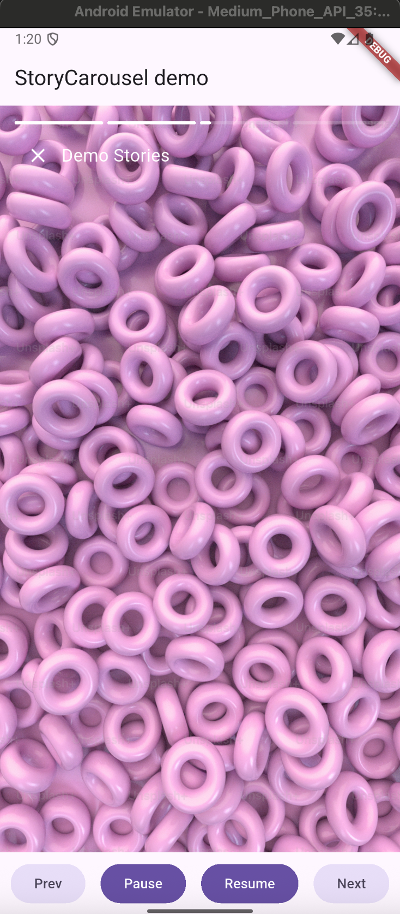
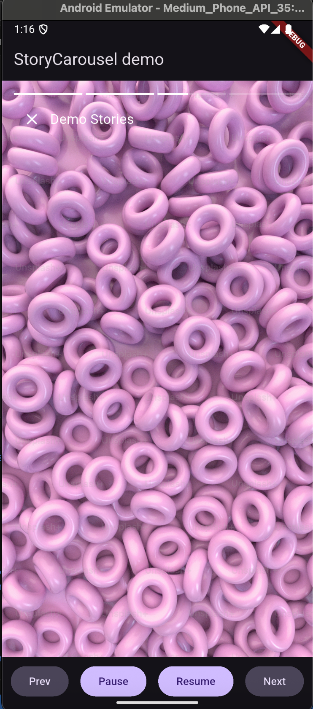

# story\_carousel

[](https://pub.dev/packages/story_carousel)

Instagram-like stories carousel for Flutter with auto-advance, gestures, and progress indicators.

* Auto-play with per-item durations
* Tap left/right to navigate, long-press to pause
* Optional controller for imperative control
* Minimal, predictable API

---

<p float="left">
  
  
</p>

---

## Install

 ```
 flutter pub add story_carousel
 ```

Or

```yaml
dependencies:
  story_carousel: ^0.1.0
```

> Flutter SDK >= 3.19.0, Dart >= 3.3.0.

---

## Quick Start

```dart
import 'package:story_carousel/story_carousel.dart';
import 'package:flutter/material.dart';

class Demo extends StatelessWidget {
  const Demo({super.key});

  @override
  Widget build(BuildContext context) {
    return StoryCarousel(
      title: 'Demo Stories',
      items: const [
        // Provide any widgets you want to show as “stories”:
        Image(
          image: NetworkImage('https://picsum.photos/600/900?1'),
          fit: BoxFit.cover,
        ),
        Center(
          child: Text(
            'Free text / any widget',
            style: TextStyle(color: Colors.white, fontSize: 20),
          ),
        ),
        Image(
          image: NetworkImage('https://picsum.photos/600/900?2'),
          fit: BoxFit.cover,
        ),
      ],
      autoPlay: true,
      loop: true,
      durationPerItem: const Duration(seconds: 5),
      onIndexChanged: (i) => debugPrint('index: $i'),
      onClose: () => Navigator.of(context).maybePop(),
    );
  }
}
```

**Gestures**

* Tap **left** area → previous
* Tap **right** area → next
* **Long-press** → pause (release to resume)

---

## Controller (optional)

Use a controller to manipulate the carousel from outside (buttons, app logic, etc.):

```dart
final controller = StoryCarouselController();

StoryCarousel(
  title: 'With Controller',
  items: const [
    Center(child: Text('One', style: TextStyle(color: Colors.white))),
    Center(child: Text('Two', style: TextStyle(color: Colors.white))),
  ],
  controller: controller,
  autoPlay: true,
);

// Somewhere else in your UI:
FilledButton(onPressed: controller.prev,   child: const Text('Prev'));
FilledButton(onPressed: controller.pause,  child: const Text('Pause'));
FilledButton(onPressed: controller.resume, child: const Text('Resume'));
FilledButton(onPressed: controller.next,   child: const Text('Next'));
```

**Controller API**

* `next()`, `prev()`, `goTo(int index)`
* `pause()`, `resume()`
* `index` / `isPaused` as `ValueNotifier`s you can listen to

---


## Example App

This repository includes a runnable example under `/example`.

**Run it:**

```bash
cd example
flutter pub get
flutter run
```

The example shows:

* Title + list of items (images + text)
* Auto-play and loop
* Long-press to pause
* External buttons using the controller

**Example dependency (in `example/pubspec.yaml`):**

```yaml
dependencies:
  story_carousel:
    path: ../
```

---

## Configuration & Options

* `title` *(String)*: Title at the top overlay (left side).
* `items` *(List<Widget>)*: Story pages (any widgets).
* `autoPlay` *(bool, default: true)*: Auto-advance items.
* `loop` *(bool, default: false)*: Wrap from last → first.
* `durationPerItem` *(Duration, default: 5s)*: Fallback duration.
* `durations` *(List<Duration>?)*: Per-item durations (must match `items.length`).
* `onIndexChanged` *(ValueChanged<int>?)*: Index callback.
* `onClose` *(VoidCallback?)*: If provided, a **close** button is shown (top-left).
* `progressBarHeight` *(double, default: 3.0)*: Segment height.
* *(Optional for testing)* `pageAnimationDuration` *(Duration, default: 220ms)*.

---

## Contributing

PRs and issues are welcome. Please run:

```bash
flutter analyze
flutter test
```

---

## License

MIT © Arturo Narváez Fontana
